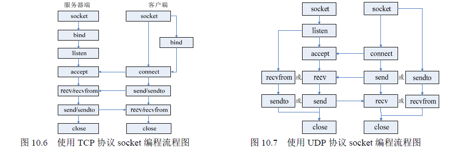

# socket 基础编程
socket 编程的基本函数有socket()、bind()、listen()、accept()、send()、sendto()、recv()以及recvfrom()等。
* socket()：该函数用于建立一个socket 连接，可指定socket 类型等信息。在建立了socket 连接之后，
可对sockaddr 或sockaddr_in 结构进行初始化，以保存所建立的socket 地址信息。
* bind()：该函数是用于将本地IP 地址绑定到端口号，若绑定其他IP 地址则不能成功。另外，它主要用于TCP 的连接，而在UDP 的连接中则无必要。
* listen()：在服务端程序成功建立套接字和与地址进行绑定之后，还需要准备在该套接字上接收新的连接请求。此时调用listen()函数来创建一个等待队列，在其中存放未处理的客户端连接请求。
* accept()：服务端程序调用listen()函数创建等待队列之后，调用accept()函数等待并接收客户端的连接请求。它通常从由bind()所创建的等待队列中取出第一个未处理的连接请求。
* connect()：该函数在TCP 中是用于bind()的之后的client 端，用于与服务器端建立连接，而在UDP中由于没有了bind()函数，因此用connect()有点类似bind()函数的作用。
* send()和recv()：这两个函数分别用于发送和接收数据，可以用在TCP 中，也可以用在UDP 中。当用在UDP 时，可以在connect()函数建立连接之后再用。
* sendto()和recvfrom()：这两个函数的作用与send()和recv()函数类似，也可以用在TCP 和UDP 中。当用在TCP 时，后面的几个与地址有关参数不起作用，函数作用等同于send()和recv()；当用在UDP 时，可以用在之前没有使用connect()的情况下，这两个函数可以自动寻找指定地址并进行连接。

```c
所需头文件#include <sys/socket.h>
函数原型int socket(int family, int type, int protocol)
函数传入值
family：
协议族
AF_INET：IPv4 协议
AF_INET6：IPv6 协议
AF_LOCAL：UNIX 域协议
AF_ROUTE：路由套接字（socket）
AF_KEY：密钥套接字（socket）
type：
套接字类型
SOCK_STREAM：字节流套接字socket
SOCK_DGRAM：数据报套接字socket
SOCK_RAW：原始套接字socket
protoco：0（原始套接字除外）
函数返回值
成功：非负套接字描述符
出错：-1
```

```c
所需头文件#include <sys/socket.h>
函数原型int bind(int sockfd, struct sockaddr *my_addr, int addrlen)
函数传入值
socktd：套接字描述符
my_addr：本地地址
addrlen：地址长度
函数返回值
成功：0
出错：-1
```

```c
所需头文件#include <sys/socket.h>
函数原型int listen(int sockfd, int backlog)
函数传入值
socktd：套接字描述符
backlog：请求队列中允许的最大请求数，大多数系统缺省值为5
函数返回值
成功：0
出错：-1
```
```c
所需头文件#include <sys/socket.h>
函数原型int accept(int sockfd, struct sockaddr *addr, socklen_t *addrlen)
函数传入值
socktd：套接字描述符
addr：客户端地址
addrlen：地址长度
函数返回值
成功：0
出错：-1
```
```c
所需头文件#include <sys/socket.h>
函数原型int connect(int sockfd, struct sockaddr *serv_addr, int addrlen)
函数传入值
socktd：套接字描述符
serv_addr：服务器端地址
addrlen：地址长度
函数返回值
成功：0
出错：-1
```
```c
所需头文件#include <sys/socket.h>
函数原型int send(int sockfd, const void *msg, int len, int flags)
函数传入值
socktd：套接字描述符
msg：指向要发送数据的指针
len：数据长度
flags：一般为0
函数返回值
成功：发送的字节数
出错：-1
```
```c
所需头文件#include <sys/socket.h>
函数原型int recv(int sockfd, void *buf,int len, unsigned int flags)
函数传入值
socktd：套接字描述符
buf：存放接收数据的缓冲区
len：数据长度
flags：一般为0
函数返回值
成功：接收的字节数
出错：-1
```
```c
所需头文件#include <sys/socket.h>
函数原型 int sendto(int sockfd, const void *msg,int len, unsigned int flags, const struct sockaddr
*to, int tolen)
函数传入值
socktd：套接字描述符
msg：指向要发送数据的指针
len：数据长度
flags：一般为0
to：目地机的IP 地址和端口号信息
tolen：地址长度
函数返回值
成功：发送的字节数
出错：-1
```
```c
所需头文件#include <sys/socket.h>
函数原型int recvfrom(int sockfd,void *buf, int len, unsigned int flags, struct sockaddr *from,
int *fromlen)
函数传入值
socktd：套接字描述符
buf：存放接收数据的缓冲区
len：数据长度
flags：一般为0
from：源主机的IP 地址和端口号信息
tolen：地址长度
函数返回值
成功：接收的字节数
出错：-1
```
Server:
```c
/*server.c*/
#include <sys/types.h>
#include <sys/socket.h>
#include <stdio.h>
#include <stdlib.h>
#include <errno.h>
#include <string.h>
#include <unistd.h>
#include <netinet/in.h>
#define PORT 4321
#define BUFFER_SIZE 1024
#define MAX_QUE_CONN_NM 5
int main()
{
    struct sockaddr_in server_sockaddr,client_sockaddr;
    int sin_size,recvbytes;
    int sockfd, client_fd;
    char buf[BUFFER_SIZE];
/*建立socket 连接*/
    if ((sockfd = socket(AF_INET,SOCK_STREAM,0))== -1)
    {
        perror("socket");
        exit(1);
    }
    printf("Socket id = %d\n",sockfd);
/*设置sockaddr_in 结构体中相关参数*/
    server_sockaddr.sin_family = AF_INET;
    server_sockaddr.sin_port = htons(PORT);
    server_sockaddr.sin_addr.s_addr = INADDR_ANY;
    bzero(&(server_sockaddr.sin_zero), 8);
    int i = 1;/* 允许重复使用本地地址与套接字进行绑定 */
    setsockopt(sockfd, SOL_SOCKET, SO_REUSEADDR, &i, sizeof(i));
/*绑定函数bind()*/
    if (bind(sockfd, (struct sockaddr *)&server_sockaddr, sizeof(struct sockaddr)) == -1)
    {
        perror("bind");
        exit(1);
    }
    printf("Bind success!\n");
/*调用listen()函数，创建未处理请求的队列*/
    if (listen(sockfd, MAX_QUE_CONN_NM) == -1)
    {
        perror("listen");
        exit(1);
    }   
    printf("Listening....\n");
/*调用accept()函数，等待客户端的连接*/
    if ((client_fd = accept(sockfd, (struct sockaddr *)&client_sockaddr, &sin_size)) == -1)
    {
        perror("accept");
        exit(1);
    }
/*调用recv()函数接收客户端的请求*/
    memset(buf , 0, sizeof(buf));
    if ((recvbytes = recv(client_fd, buf, BUFFER_SIZE, 0)) == -1)
    {
        perror("recv");
        exit(1);
    }
    printf("Received a message: %s\n", buf);
    close(sockfd);
    exit(0);
}
```

client:
```c
/*client.c*/
#include <stdio.h>
#include <stdlib.h>
#include <errno.h>
#include <string.h>
#include <netdb.h>
#include <sys/types.h>
#include <netinet/in.h>
#include <sys/socket.h>
#define PORT 4321
#define BUFFER_SIZE 1024
int main(int argc, char *argv[])
{
    int sockfd,sendbytes;
    char buf[BUFFER_SIZE];
    struct hostent *host;
    struct sockaddr_in serv_addr;
    if(argc < 3)
    {
        fprintf(stderr,"USAGE: ./client Hostname(or ip address) Text\n");
        exit(1);
    }
/*地址解析函数*/
    if ((host = gethostbyname(argv[1])) == NULL)
    {
        perror("gethostbyname");
        exit(1);
    }
    memset(buf, 0, sizeof(buf));
    sprintf(buf, "%s", argv[2]);
/*创建socket*/
    if ((sockfd = socket(AF_INET, SOCK_STREAM, 0)) == -1)
    {
        perror("socket");
        exit(1);
    }
/*设置sockaddr_in 结构体中相关参数*/
    serv_addr.sin_family = AF_INET;
    serv_addr.sin_port = htons(PORT);
    serv_addr.sin_addr = *((struct in_addr *)host->h_addr);
    bzero(&(serv_addr.sin_zero), 8);
/*调用connect 函数主动发起对服务器端的连接*/
    if(connect(sockfd,(struct sockaddr *)&serv_addr, sizeof(struct sockaddr))== -1)
    {
        perror("connect");
        exit(1);
    }
/*发送消息给服务器端*/
    if ((sendbytes = send(sockfd, buf, strlen(buf), 0)) == -1)
    {
        perror("send");
        exit(1);
    }
    close(sockfd);
    exit(0);
}
```