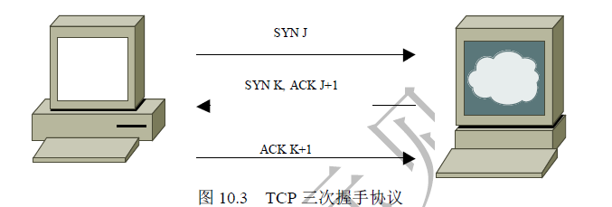
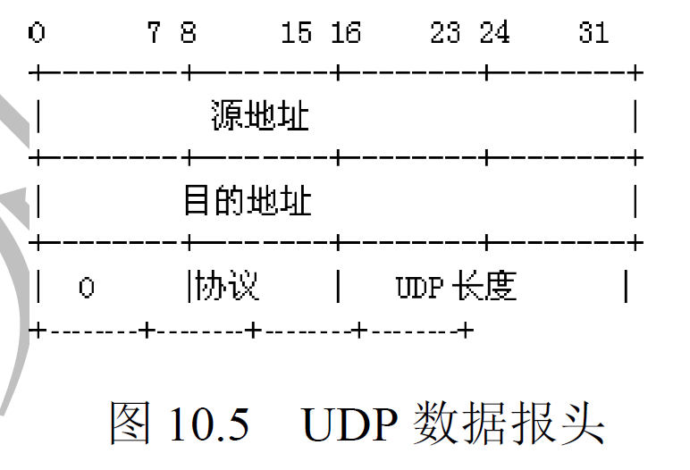

# 嵌入式 Linux 网络编程
OSI是Open System Interconnection的缩写，意为开放式系统互联。国际标准化组织（ISO）制定了OSI模型，该模型定义了不同计算机互联的标准，是设计和描述计算机网络通信的基本框架。
1. OSI 协议参考模型： 应用层、表示层、会话层、传输层、网络层、数据链路层及物理层。
2. TCP/IP 的4 层模型
* 网络接口层：负责将二进制流转换为数据帧，并进行数据帧的发送和接收。要注意的是数据帧是独立的网络信息传输单元。
* 网络层：负责将数据帧封装成 IP 数据包，并运行必要的路由算法。
* 传输层：负责端对端之间的通信会话连接与建立。传输协议的选择根据数据传输方式而定。
* 应用层：负责应用程序的网络访问，这里通过端口号来识别各个不同的进程。
3. TCP/IP协议族

## TCP 和UDP
## 1．TCP
同其他任何协议栈一样，TCP 向相邻的高层提供服务。因为TCP 的上一层就是应用层，因此，TCP 数据传输实现了从一个应用程序到另一个应用程序的数据传递。应用程序通过编程调用TCP 并使用TCP 服务，提供需要准备发送的数据，用来区分接收数据应用的目的地址和端口号。 
通常应用程序通过打开一个 socket 来使用TCP 服务，TCP 管理到其他socket 的数据传递。可以说，通过IP 的源/目的可以惟一地区分网络中两个设备的连接，通过socket 的源/目的可以惟一地区分网络中两个应用程序的连接。

### 三次握手协议
TCP 对话通过三次握手来进行初始化。三次握手的目的是使数据段的发送和接收同步，告诉其他主机其一次可接收的数据量，并建立虚连接。

* 初始化主机通过一个同步标志置位的数据段发出会话请求。
* 接收主机通过发回具有以下项目的数据段表示回复：同步标志置位、即将发送的数据段的起始字节的顺序号、应答并带有将收到的下一个数据段的字节顺序号。
* 请求主机再回送一个数据段，并带有确认顺序号和确认号。

TCP 实体所采用的基本协议是滑动窗口协议。当发送方传送一个数据报时，它将启动计时器。当该数据报到达目的地后，接收方的TCP 实体往回发送一个数据报，其中包含有一个确认序号，它表示希望收到的下一个数据包的顺序号。如果发送方的定时器在确认信息到达之前超时，那么发送方会重发该数据包。

### TCP 数据包头
* 源端口、目的端口：16 位长。标识出远端和本地的端口号。
* 序号：32 位长。标识发送的数据报的顺序。
* 确认号：32 位长。希望收到的下一个数据包的序列号。
* TCP 头长：4 位长。表明TCP 头中包含多少个32 位字。
* 6位未用。
    * ACK：ACK 位置1 表明确认号是合法的。如果ACK 为0，那么数据报不包含确认信息，确认字段被省略。
    * PSH：表示是带有PUSH 标志的数据。接收方因此请求数据包一到便将其送往应用程序而不必等到缓冲区装满时才传送。
    * RST：用于复位由于主机崩溃或其他原因而出现的错误连接。还可以用于拒绝非法的数据包或拒绝连接请求。
    * SYN：用于建立连接。
    * FIN：用于释放连接。
    * 窗口大小：16 位长。窗口大小字段表示在确认了字节之后还可以发送多少个字节。
    * 校验和：16 位长。是为了确保高可靠性而设置的。它校验头部、数据和伪TCP 头部之和。
    * 可选项：0 个或多个32 位字。包括最大TCP 载荷，滑动窗口比例以及选择重发数据包等选项。

## 2.   UDP
UDP 即用户数据报协议，它是一种无连接协议，因此不需要像TCP 那样通过三次握手来建立一个连接。同时，一个UDP 应用可同时作为应用的客户或服务器方。它比TCP 协议更为高效，也能更好地解决实时性的问题。如今，包括网络视频会议系统在内的众多的客户/服务器模式的网络应用都使用UDP 协议。
### UDP 数据报头。
* 源地址、目的地址：16 位长。标识出远端和本地的端口号。
* 数据报的长度是指包括报头和数据部分在内的总的字节数。因为报头的长度是固定的，所以该域主要用来计算可变长度的数据部分（又称为数据负载）。

## 3.协议选择
协议的选择应该考虑到以下 3 个方面。
* 对数据可靠性的要求。
对数据要求高可靠性的应用需选择 TCP 协议，如验证、密码字段的传送都是不允许出错的，而对数据的可靠性要求不那么高的应用可选择UDP 传送。
* 应用的实时性。
TCP 协议在传送过程中要使用三次握手、重传确认等手段来保证数据传输的可靠性。使用TCP 协议会有较大的时延，因此不适合对实时性要求较高的应用，如VOIP、视频监控等。相反，UDP 协议则在这些应用中能发挥很好的作用。
* 网络的可靠性。
由于 TCP 协议的提出主要是解决网络的可靠性问题，它通过各种机制来减少错误发生的概率。因此，在网络状况不是很好的情况下需选用TCP 协议（如在广域网等情况），但是若在网络状况很好的情况下（如局域网等）就不需要再采用TCP 协议，而建议选择UDP 协议来减少网络负荷。